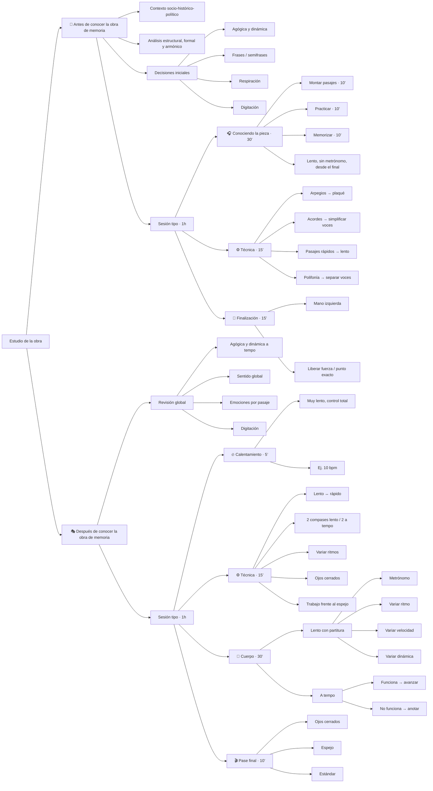

# 🎼 Antes de conocer la obra de memoria
- Conocer contexto socio-histórico-político que preceden la obra.
- Análisis estructural, formal, armónico.
- Toma inicial de decisiones sobre agógica y dinámica. Búsqueda de frases y semifrases. Dónde respirar y dónde no. Digitación.
- Toma de decisiones inicial: qué vamos a trabajar en la sesión y con qué objetivo. Qué pasajes y de qué manera.

> [!NOTE]
> Los ejemplos se harán en función de 1h de estudio.

> [!TIP]
> **Antes de empezar** (2-3 min): respiración diafragmática (3 ciclos lentos), check de tensiones en hombros, brazos y manos. Soltar el cuerpo antes de tocar la primera nota. Esto aplica a cualquier sesión de estudio.

## 🎧 Conociendo la pieza (30 min)
- Montar un número determinado de pasajes. (10 min) 
- Practicar los mismos. (10 min) 
- Intentar memorizarlos. (10 min)

> [!IMPORTANT]
> Practicar lento y sin metrónomo, muy escalonado para ir aprendiendo compases y uniones por separado. Buena idea empezar a estudiar por los compases del final.

## ⚙️ Escoger uno de la siguiente lista cada día (15 min)
- Práctica de arpegios y pasajes veloces o virtuosísticos: Simplificar inicialmente. Escoger uno de la siguiente lista cada día.
  - Si hay arpegios -> Plaqué.
  - Si hay acordes plaqué -> Practicar quitando voces intermedias o extremas. Ir añadiendo hasta cómodamente ser capaz de tocar todas las notas del acorde con el mismo volumen. Una vez el acorde esté completo, probar a destacar 1 voz en concreto. Por ejemplo, acorde de 4 notas, que se escuche más la 2a voz.
  - Si hay pasajes rápidos -> Practicarlos lento y sin metrónomo. Habituación de la mano sobre el pasaje.
  - Si hay polifonía y movimientos imitativos -> Separar voces y practicar únicamente la coherencia entre las distintas voces. Que suenen siempre de la misma manera.

## 🧘 Finalización (15 min)
- Revisión de los pasajes trabajados el día a través de la mano izquierda. Buscando liberar fuerza desde el primer momento y pulsar en el punto exacto de la tastiera.

## 📝 Cierre (2 min)
- Anota 1 cosa que ha funcionado hoy y 1 cosa que trabajarás en la próxima sesión. Esto cierra el ciclo de estudio consciente.

---

# 🎭 Después de conocer la obra de memoria:
- Toma de decisiones inicial: qué vamos a trabajar en la sesión y con qué objetivo. Qué pasajes y de qué manera. 
- Revisión de la toma de decisiones agógica y dinámica. ¿Funciona a velocidades más cercanas al tempo real?
- ¿Sabemos qué quiere decir la obra en su totalidad?
- ¿Sabemos qué quiere decir la obra y las emociones asociadas a cada pasaje?
- Revisión de digitación.

## 🔥 Calentamiento (5 min)
- Tocar un par de pasajes muy lento, muy controlado, buscando no fallar notas y con la menor presión posible sobre el mástil. Lo suficientemente lento como para que el pasaje no sea difícil. 

> [!NOTE]
> Ejemplo: 10 bpm

## ⚙️ Escoger uno de la siguiente lista cada día (15 min)
>[!Important]
>Escoger uno de la siguiente lista en cada sesión

1. Práctica de arpegios y pasajes veloces o virtuosísticos: Respetando lo escrito:
	  - Repasar durante un tiempo determinado el pasaje, alternando entre velocidades lentas y rápidas para habituar al cuerpo.
	  - Repasar muy lento durante 2 compases, y a tempo los 2 siguientes.
	  - Repasar cambiando el ritmo. Ejemplo, si son corcheas, alargar la primera y acortar la segunda, a modo de corchea con puntillo-semicorchea. Alternar.
	  - Repasar con los ojos cerrados
2. Estudiar enfrente de un espejo observando las distintas secciones del cuerpo cada vez. 1 pase, 1 objetivo. ¿Cuáles son las manías de nuestro cuerpo y en qué pasajes surgen? Anotar para resolver en la siguiente sesión.

## 🎼 Cuerpo (30 min)
Práctica de frases o semifrases determinadas en función de la sesión anterior y de las dificultades que planteen. 
- Práctica lenta, con partitura, de uno o varios compases. 
  - Con metrónomo.
  - Variando el ritmo.
  - Variando la velocidad
  - Variando la dinámica. ¿Qué suena mejor y más convincente?
- Práctica a tempo, con partitura o de memoria de los compases trabajados, a fin de comprobar si ha funcionado.
  - Si se ha solucionado el error, continuar a otro pasaje.
  - Si no se ha solucionado el error, anotar pasa la siguiente sesión y continuar a otro pasaje.

> [!IMPORTANT]
> En esta parte es importante resolver al menos 1 de los problemas que sintamos que la pieza nos plantea. Si no es posible resolverlo, al menos apuntar a que nos salga mejor 7/10 repeticiones.

## 🎬 Pase final (10 min)
Tocar de principio a fin sin parar y con concentración, intentando respetar las decisiones musicales y posturales tomadas en la sesión de estudio

>[!Important]
>Escoger uno de la siguiente lista en cada sesión
1. Pase con ojos cerrados
2. Pase frente al espejo
3. Pase estándar
4. Pase grabado — escúchate después sin el instrumento. Detectas cosas que en el momento no percibes.

## 📝 Cierre (2 min)
- Anota 1 cosa que ha funcionado hoy y 1 cosa que trabajarás en la próxima sesión. Esto cierra el ciclo de estudio consciente.

>[!Tip]
> - Si no sale a tempo, hacerlo más lento y con metrónomo. 
> 	- Si da tiempo, hacer otro pase sin metrónomo.
  > - Si sale a tempo y hay dificultades en la unión de compases, añadir metrónomo. 
  > 	- Si da tiempo, hacer otro pase sin metrónomo.
  > - Si sale a tempo sin dificultades en la unión de compases, intentar anotar en qué pasajes hay suciedad de notas o pequeños fallos para trabajarlos en la siguiente sesión. 
  > 	- Si da tiempo, hacer otro pase con metrónomo.

